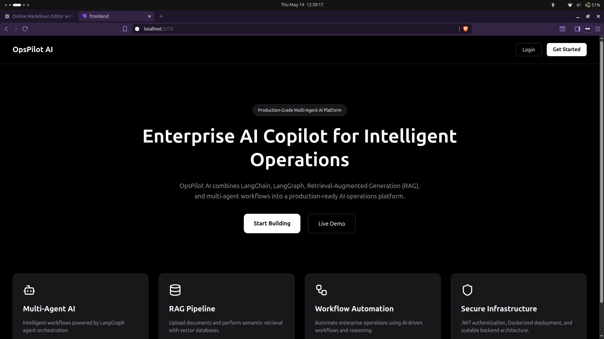
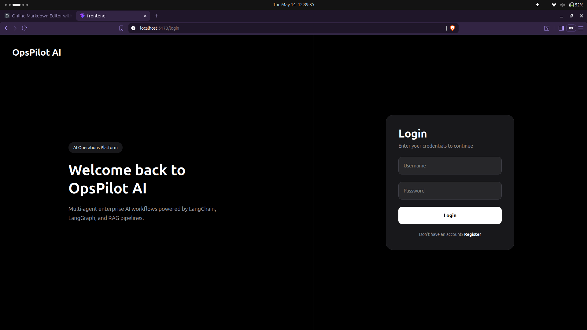
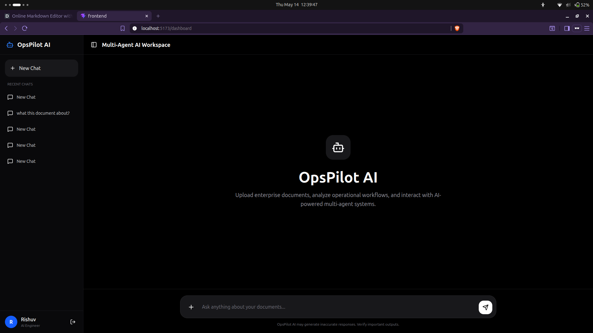
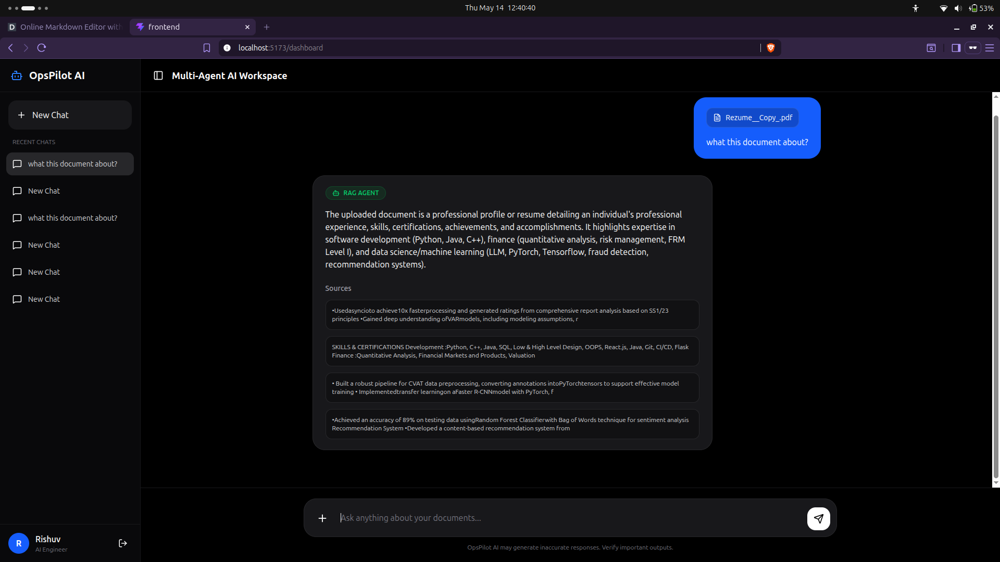

# OpsPilot AI

A production-grade multi-agent Generative AI platform built using React, Django, LangChain, LangGraph, Gemini, and Qdrant.

OpsPilot AI enables users to upload enterprise documents, perform intelligent Retrieval-Augmented Generation (RAG), interact with multiple AI agents, and maintain persistent conversational memory through a modern ChatGPT-style interface.

---

# Features

## AI Features
- Multi-Agent AI Architecture using LangGraph
- Retrieval-Augmented Generation (RAG)
- Gemini LLM Integration
- Gemini Embeddings
- Vector Search using Qdrant
- Conversational Memory
- Context-Aware Responses
- Source Citations
- Intelligent Agent Routing

---

## Agents

### Router Agent
Routes user queries intelligently.

### RAG Agent
Answers questions from uploaded documents.

### Report Agent
Generates professional reports and summaries.

### Analytics Agent
Performs analytical evaluations and insights generation.

---

## Full Stack Features
- JWT Authentication
- Refresh Token Authentication
- Persistent Chat Sessions
- Professional ChatGPT/Gemini Style UI
- Protected Routes
- PDF Upload Support
- Responsive Frontend
- Dockerized Infrastructure

---

# Tech Stack

## Frontend
- React
- TypeScript
- TailwindCSS
- React Router
- Axios
- React Markdown

---

## Backend
- Django
- Django REST Framework
- PostgreSQL

---

## AI Stack
- LangChain
- LangGraph
- Gemini API
- Qdrant Vector Database

---

## DevOps
- Docker
- Docker Compose

---

# System Architecture

```text
Frontend (React)
       ↓
Django REST API
       ↓
LangGraph Workflow
       ↓
──────────────────────────
| Router Agent           |
──────────────────────────
   ↓        ↓         ↓
RAG     Report     Analytics
Agent     Agent        Agent
   ↓
LangChain + Gemini
   ↓
Qdrant Vector Database
```

---

# Project Structure

```text
opspilot-ai/
│
├── backend/
│   ├── agents/
│   ├── api/
│   ├── authentication/
│   ├── config/
│   ├── graph/
│   ├── rag/
│   └── uploads/
│
├── frontend/
│   ├── src/
│   ├── public/
│   └── components/
│
└── docker-compose.yml
```

---

# Screenshots

## Landing Page



---

## Login Page



---

## Dashboard



---

## Multi-Agent RAG Response



---

# Setup Instructions

## Clone Repository

```bash
git clone https://github.com/rishuvgorka/OpsPilot-AI.git
cd opspilot-ai
```

---

# Backend Environment Variables

Create:

```text
backend/.env
```

Add:

```env
DEBUG=True

SECRET_KEY=your_secret_key

DB_NAME=opspilot
DB_USER=postgres
DB_PASSWORD=postgres
DB_HOST=db
DB_PORT=5432

GOOGLE_API_KEY=your_gemini_api_key
```

Secret Key can be anything.


---

# Run with Docker

```bash
docker compose up --build
```

---

# Access Application

Frontend:
```text
http://localhost:5173
```

Backend:
```text
http://localhost:8000
```

---

# Authentication Flow

1. Register Account
2. Login
3. JWT Access Token Issued
4. Refresh Token Rotation
5. Protected API Access

---

# RAG Pipeline

1. Upload PDF
2. Document Chunking
3. Gemini Embedding Generation
4. Vector Storage in Qdrant
5. Semantic Retrieval
6. Context-Aware AI Response

---

# Multi-Agent Workflow

## Router Agent
Determines which agent should handle the query.

### Routing Examples

| Query Type | Agent |
|---|---|
| Document Q&A | RAG Agent |
| Reports | Report Agent |
| Analysis | Analytics Agent |

---

# Example Queries

## RAG
```text
What are the main topics discussed in the uploaded document?
```

---

## Report
```text
Generate a report about operational efficiency.
```

---

## Analytics
```text
Analyze trends and risks in crew scheduling.
```

---

# Key Engineering Highlights

- Production-grade AI architecture
- Multi-agent orchestration using LangGraph
- Semantic search with vector embeddings
- Persistent conversational memory
- JWT authentication with refresh tokens
- Dockerized full-stack infrastructure
- Modern AI SaaS interface
- Scalable backend architecture

---

# Future Improvements

- Streaming responses
- Redis + Celery
- Real-time websocket updates
- Kubernetes deployment
- LangSmith observability
- OCR support
- CSV analytics engine
- Multi-modal support
